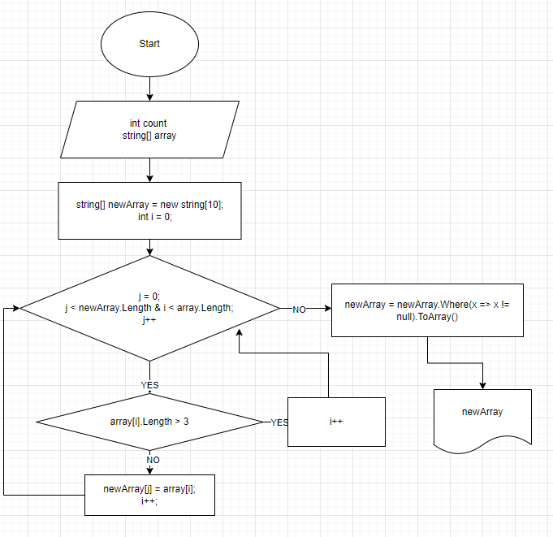

## Решение производится с использованием трёх методов:
1. **Получаем начальный массив**:
```
string[] GetStringArray()
{
    Console.Write("Введите количество элементов массива:\t");
    int count = int.Parse(Console.ReadLine() ?? "0");
    string[] array = new string[count];
    for (int i = 0; i < array.Length; i++)
    {
        Console.Write($"Введите элемент массива {i + 1}:\t");
        array[i] = Console.ReadLine();
    }
    Console.WriteLine("Вывод массива: ");
    PrintArray(array);
    return array;
}
```
Получаем количество элементов из консоли, затем создаём новый массив **_array_** и заполняем его значениями, которые будут вводится через консоль.

2. **Печатаем массив**:
```
void PrintArray(string[] array) 
{
    Console.Write("[");
    for (int i = 0; i < array.Length - 1; i++)
    {
        Console.Write(array[i] + ", ");
    }
    Console.Write(array[array.Length - 1] + "]");
    Console.WriteLine("");
}
```
3. **Метод для проверки количества символов элемента массива и создания нового массива только с отобранными элементами.**
```
string[] CheckChar(string[] array, int number)
{
    string[] newArray = new string[10];
    int i = 0;
    for (int j = 0; j < newArray.Length & i < array.Length; j++)
    {
        if (array[i].Length > number) 
        {
            i++;
        }
        else
        {
            newArray[j] = array[i];
            i++;
        }

    }
    newArray = newArray.Where(x => x != null).ToArray();
    return newArray;
}
```
Создаём новый массив с количеством элементов 10 *(так как точное число элементов не известно)*. Перебираем элементы нового массива, добавляя элемент из начального массива, если его длина меньше либо равна заявленного *(в данном случае используем число 3)*. В итоге у нас получится новый массив с пустыми элементами.
Чтобы убрать пустые элементы, используем методы  **where** и **ToArray**.

## Ниже добавлен алгоритм:

